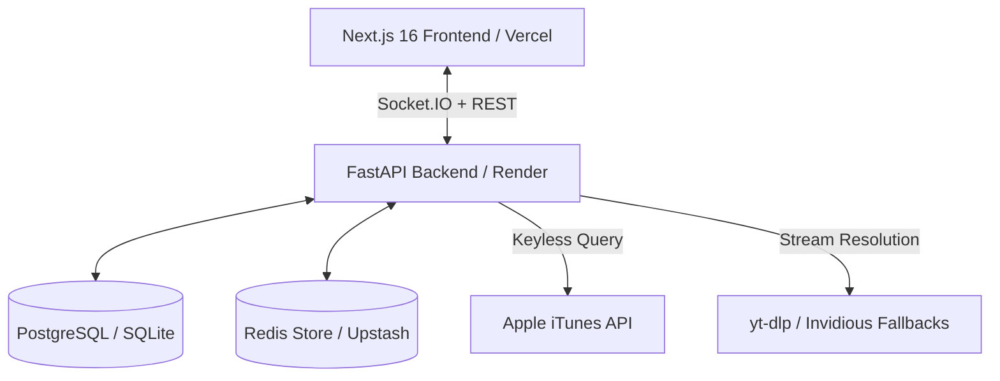

# 📜 OpenJam — Product Requirements Document (PRD)

> **Copyright (c) 2026 Chaitanya. All Rights Reserved.**  
> *This Product Requirements Document (PRD) is proprietary intellectual property. Unauthorized copying, re-branding, commercial distribution, or derivative work without written consent is strictly prohibited.*

---

## 1. Executive Summary & Vision

**OpenJam** is a real-time, synchronized social listening platform that allows users to create virtual rooms, invite friends, search for tracks, manage democratic queues, and listen to music in exact synchronization across devices—without requiring third-party audio accounts or paid subscriptions.

### Core Philosophy
- **Zero Friction**: No forced accounts; instant guest access with optional Discord OAuth.
- **Millisecond Sync**: Clock offset compensation so all room listeners hear the exact same audio beat simultaneously.
- **100% Free & Open Integration**: Built to run entirely on free-tier infrastructure (Vercel, Render, Supabase, Redis) using keyless search (iTunes API) and server-side stream resolution.

---

## 2. Product Features & Requirements

### 2.1 Room & Session Management
- **Instant Creation**: Users can create a room in 1 click with an optional password for private sessions.
- **Dynamic Host Handoff**: If the room creator leaves, host controls seamlessly transfer to the next longest-standing listener.
- **Live Listener Counts**: Real-time listing of active listeners with avatars, names, and host indicators.

### 2.2 Synchronized Audio Engine
- **NTP-Style Clock Sync**: Calculates network Round-Trip Time (RTT) and clock offset (`sync_ping` / `sync_pong`) to adjust playback positions for network latency.
- **Fast 2.5s Recovery**: Automated fallback retry mechanism (`low=true`, cache-busters, YouTube IFrame fallback) recovering from network stalls within 2.5 seconds.
- **Silent Handling**: Background retries execute without alarming red console errors or UI toast spam.

### 2.3 Democratic Queue & Discovery
- **Search Engine**: Keyless track search powered by Apple iTunes API with instant result debouncing.
- **Queue Operations**: Add, remove, vote-to-skip, reorder (host drag-and-drop), and export queue to custom playlists.
- **Personal Favourites**: Save liked songs locally or to a user profile for instant 1-tap re-queuing.

### 2.4 Real-Time Chat & Floating Reactions
- **Socket.IO Chat**: Instant chat messaging with typing status indicators and Discord avatar integration.
- **Flying Emoji Pop-Up Engine**: Clicking emoji reactions triggers flying floating particle animations across the screen for all room members without clogging chat text history.

### 2.5 Responsive UI & PWA Experience
- **Soft SPA Navigation**: Next.js client-side navigation (`router.push`) preventing full browser reloads and socket disconnections.
- **Visual Color Bleed**: Dynamic ambient album cover extraction creating smooth animated background gradients.
- **Installable PWA**: Manifest and service worker support for seamless mobile & desktop installation.

---

## 3. Technical Architecture & Tech Stack

- **Frontend**: Next.js 16 (App Router + Turbopack), Vanilla CSS design system, Framer Motion, Socket.IO Client.
- **Backend**: Python 3.11+, FastAPI, AsyncIO, Python-SocketIO, httpx, yt-dlp.
- **Database**: SQLite (local) / PostgreSQL (production via Supabase / Render).
- **Cache**: Redis / Upstash with fallback to local in-memory dictionaries.

---

## 4. Non-Functional Requirements

- **Performance**: Initial track buffering < 2.5 seconds; clock synchronization accuracy within ±50ms.
- **Cost**: Optimized to run 100% on free-tier infrastructure.
- **Security**: Password hashing, CORS origin validation, input sanitization, and strict Discord OAuth token validation.

---

## 5. Intellectual Property & Copyright Notice

**Copyright (c) 2026 Chaitanya. All Rights Reserved.**  
This repository is protected by copyright law and proprietary software terms.
- **No Uncredited Re-branding**: Unauthorized cloning, re-skinning, commercial SaaS deployment, or removal of attribution headers will be met with immediate legal recourse and **DMCA Takedown Notices**.
- See [COPYRIGHT_WARNING.md](file:///c:/Users/patil/OneDrive/Desktop/open/OpenJam/COPYRIGHT_WARNING.md) for full terms of use.
