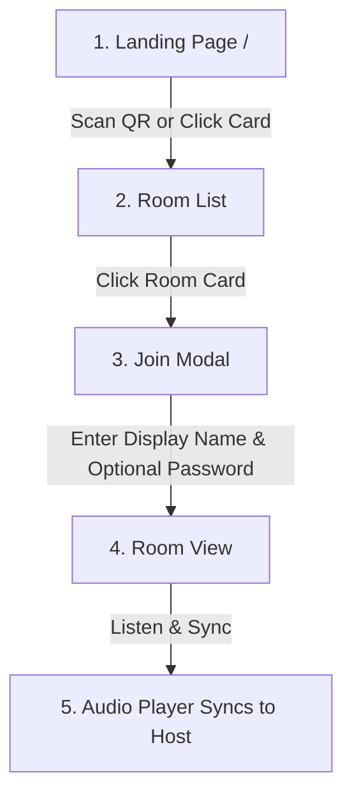
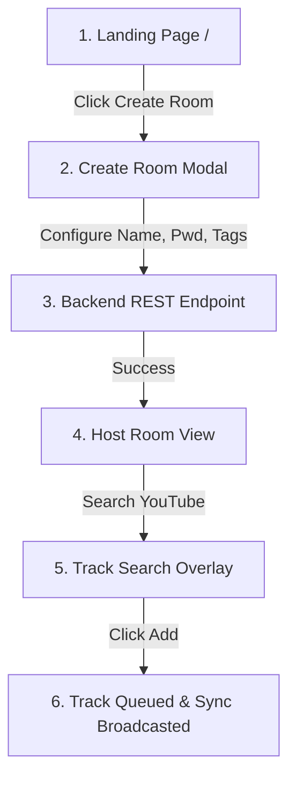

# Application Flow Map — OpenJam V2

This document details the navigation flows, user journeys, and real-time socket operations inside the OpenJam V2 application.

---

## 1. User Journey Maps

### 1.1. Guest User: Discover and Join

### 1.2. Host User: Create and Manage

---

## 2. Interaction Flows & Tab Systems

### 2.1. Mobile Layout Responsive Switching
On viewports under `640px`, the desktop three-panel grid (Sidebar, Music Player, Chat) folds into a single-panel viewport controlled by a bottom tab navigator:

1. **Tab 1: Queue (Default)**
   - Displays current track queue list.
   - Allows users to upvote tracks.
   - Shows drag handles for hosts to manually sort.
2. **Tab 2: Players & Controls**
   - Main vinyl rotating disc interface.
   - Playback bar (progress slider).
   - Dynamic Lyrics Toggle.
3. **Tab 3: Live Chat & Presence**
   - Active user list (Host badges, user initials, presence dots).
   - Real-time chat feed with instant bubbles.

---

## 3. Lyrics Mode Toggle Flow
Inside the main player tab, activating "Lyrics Mode" triggers the following transition:
- **Visual Stacking**: Album artwork container shrinks or hides to maximize vertical height.
- **Top Area**: Scrolling viewport displays active synced lyrics line (styled with amber highlight and drop glow).
- **Bottom Area**: Interactive playback seek bar and utility controls remain locked and interactive.

---

## 4. Socket Lifecycle Events

| Stage | Socket Event | Initiated By | Action Taken |
| :--- | :--- | :--- | :--- |
| **Join** | `join_room` | Client | Adds user socket to channel room pool; triggers presence broadcast. |
| **Join Sync** | `room_joined` | Server | Sends current queue state, user list, and playback status to joiner. |
| **Queue Add** | `add_to_queue` | Client | Appends selected track object to queue; broadcasts update. |
| **Vote** | `vote_track` | Client | Logs user vote on a track; re-sorts and broadcasts queue list. |
| **Sync Tick** | `player_state_change` | Host | Updates master playback state and timestamp. |
| **Chat msg** | `chat_message` | Client | Broadcasts chat text; appends to room history. |
| **Typing** | `typing_status` | Client | Signals user activity to display writing indicator. |
| **Teardown**| `leave_room` | Client | Removes presence; deletes room database state if host disconnects. |
