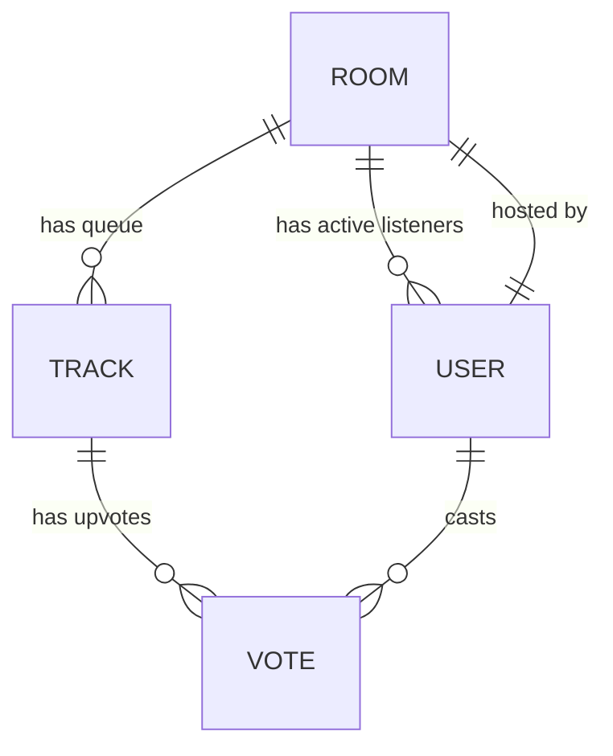

# Backend Database Schema & API Specification — OpenJam V2

This document specifies the database entity relationships, API endpoints, and WebSocket event structures used by the OpenJam V2 backend.

---

## 1. Data Models (Logical Schema)

### 1.1. Room Entity
Represents an active synchronized listening session.
- `id`: `UUID` (Primary Key)
- `name`: `String` (Unique, max 50 chars)
- `description`: `String` (Optional, max 150 chars)
- `is_private`: `Boolean` (Default: `false`)
- `password_hash`: `String` (Null if public)
- `genre_tags`: `Array[String]` (Max 3 tags per room)
- `host_id`: `String` (References User ID)
- `created_at`: `DateTime`

### 1.2. Track Entity
Represents an audio track queued in a room.
- `id`: `UUID` (Primary Key)
- `room_id`: `UUID` (Foreign Key -> Room)
- `track_name`: `String`
- `artist`: `String`
- `track_uri`: `String` (YouTube Video ID)
- `album_art_url`: `String` (Optional WebP link)
- `duration_ms`: `Integer`
- `queued_by`: `String` (References User ID)
- `is_playing`: `Boolean`
- `order_index`: `Integer` (Determines fallback sorting order)

### 1.3. User Entity
Represents an active room participant session.
- `id`: `String` (Primary Key, session identifier)
- `display_name`: `String`
- `avatar_url`: `String` (Optional avatar reference)
- `is_host`: `Boolean` (Determines write permission levels)
- `room_id`: `UUID` (Foreign Key -> Room, null if lobby)
- `joined_at`: `DateTime`

### 1.4. Vote Entity
Tracks listener votes on queued tracks.
- `track_id`: `UUID` (Foreign Key -> Track)
- `user_id`: `String` (Foreign Key -> User)
- `room_id`: `UUID` (Foreign Key -> Room)

---

## 2. REST API Specification

### 2.1. Room Controller
- **Create Room**
  - `POST /rooms`
  - Body: `{ name, description, is_private, password, genre_tags }`
  - Response: `201 Created` -> `{ id, name, is_private, host_id }`
- **List Public Rooms**
  - `GET /rooms`
  - Response: `200 OK` -> `List[{ id, name, listener_count, current_track }]`
- **Close Room (Host Only)**
  - `DELETE /rooms/{id}`
  - Response: `200 OK` -> `{ success: true }`

### 2.2. Search Controller
- **YouTube API Query**
  - `GET /search`
  - Params: `?q=query_string`
  - Response: `200 OK` -> `List[{ track_name, artist, track_uri, album_art_url, duration_ms }]`

---

## 3. WebSocket Event Payloads

### 3.1. Client to Server Events
- **`join_room`**
  - Payload: `{ room_id, password }`
- **`leave_room`**
  - Payload: `{ room_id }`
- **`add_to_queue`**
  - Payload: `{ room_id, track_name, artist, track_uri, album_art_url, duration_ms }`
- **`vote_track`**
  - Payload: `{ room_id, track_id }`
- **`player_state_change`**
  - Payload: `{ room_id, position_ms, is_playing }`
- **`chat_message`**
  - Payload: `{ room_id, text }`
- **`typing_status`**
  - Payload: `{ room_id, is_typing }`

### 3.2. Server to Client Events
- **`room_joined`**: Returns complete initial state payload.
- **`queue_updated`**: Broadcasts the newly sorted track queue.
- **`player_state_sync`**: Broadcasts master position seek updates.
- **`chat_message_received`**: Distributes new message bubbles to room users.
- **`typing_status_update`**: Displays or hides active typing indicators.
- **`user_presence_change`**: Updates active listener lists.
