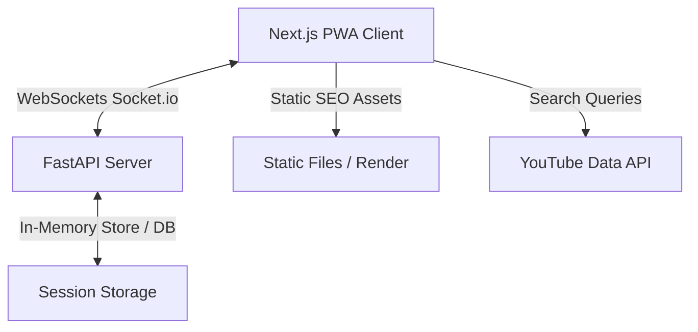
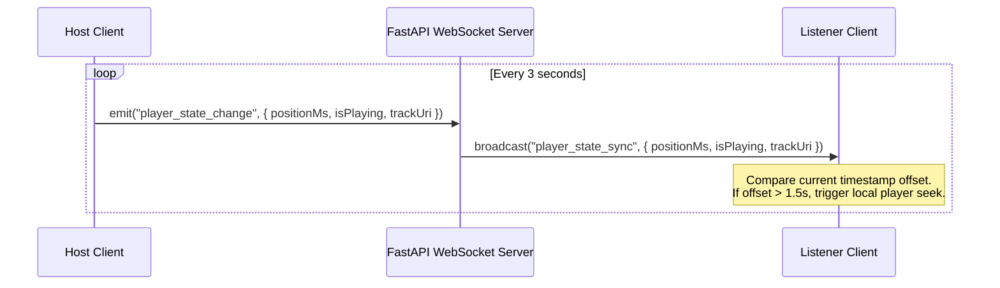

# Technical Requirement Document (TRD) — OpenJam V2

## 1. System Architecture
OpenJam V2 is a decentralized listening platform built with a Next.js (Node.js) frontend and a FastAPI (Python) backend connected over low-latency WebSockets.



---

## 2. Technical Stack
- **Frontend Framework**: Next.js 16 (App Router, Turbopack for compilation speed).
- **Styling**: Vanilla CSS with HSL variables.
- **Client-Side Animation**: Framer Motion (page transitions and structural elements), GSAP (room panel switches).
- **Communication Protocol**: Socket.io-client.
- **Backend API**: FastAPI (Python 3.11+).
- **Real-time Engine**: Python-Socketio.
- **Service Worker**: PWA caching with fallback navigation overrides.

---

## 3. Core Sync Protocol
Synchronization is achieved through WebSocket communication using a master-listener replication pattern.



### 3.1. Drift Correction Algorithm
The listening client runs a synchronization loop checking local player state:
$$\text{Drift} = | t_{\text{local}} - t_{\text{host}} |$$
- If $\text{Drift} > 1.5\text{s}$, seek the YouTube player immediately to $t_{\text{host}}$.
- If the host pauses, immediately pause the listener client.
- If the host plays, immediately play the listener client.

---

## 4. Performance & Rendering Optimizations

### 4.1. 4x Downscaled Canvas Rendering
To prevent frame rate drops caused by high-resolution redraws:
- **Canvas Resolution**: The `#ambient-canvas` raster dimensions are scaled down to 25% of the viewport bounds:
  $$\text{Canvas Width} = \lfloor \frac{W_{\text{viewport}}}{4} \rfloor$$
  $$\text{Canvas Height} = \lfloor \frac{H_{\text{viewport}}}{4} \rfloor$$
- **GPU Promotion**: The element is promoted to its own compositing layer to bypass main thread layout invalidations:
  ```css
  #ambient-canvas {
    transform: translate3d(0, 0, 0);
    backface-visibility: hidden;
    filter: blur(20px);
  }
  ```
- **Upscaling Interpolation**: The browser performs hardware-accelerated bilinear upscaling to stretch the canvas to 100% width and height, reducing GPU math load by **93.75%**.

### 4.2. Image Payload Reduction
All non-icon static banners and placeholders are compressed into `.webp` assets, reducing file sizes from ~6.5MB total to 1.05MB (83.8% bandwidth savings).

---

## 5. PWA caching & Service Worker (sw.js)
The Service Worker utilizes a Cache-First strategy for static assets and a Network-Only bypass for WebSocket events and dynamic actions.
- **Precaching**: Pre-caches `/`, `/offline`, and core logo/manifest icons during registration.
- **CORS & WebSocket Bypass**: Explicitly bypasses paths starting with `/socket.io`, `/stream`, `/search`, and `/rooms` to prevent caching active media flows.
- **Offline Redirection**: Catches failed page navigation requests (`mode: 'navigate'`) and returns the pre-cached `/offline` static component.
